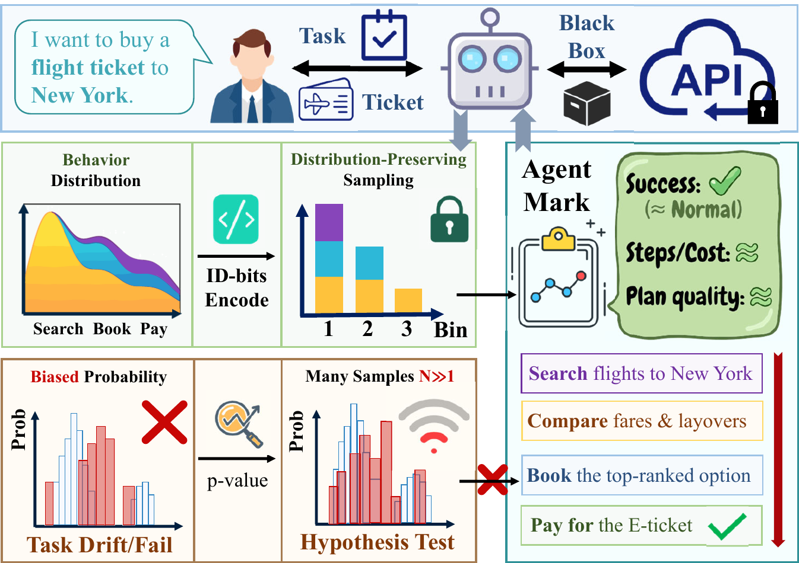
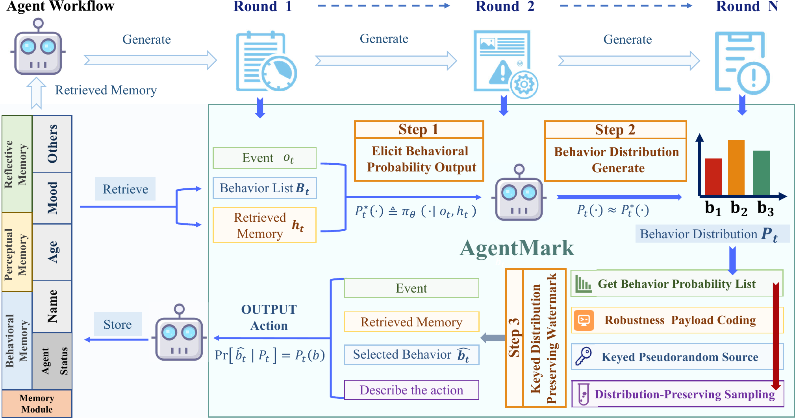

<div align="center">
  
  

  **Experimental Framework for LLM Agent Behavioral Watermarking**

  [简体中文](README_zh.md) | [English](README.md)

  
  
</div>

<div align="center">
  
</div>

---


**AgentMark** is an experimental framework focused on **LLM Agent Behavioral Watermarking**, implementing the Utility Preservation and Distribution-Preserving watermarking algorithms proposed in the **Agent Mark** paper.

This project aims to provide a reproducible, modular, and extensible codebase for evaluating the performance, robustness, and stealthiness of watermarking algorithms in complex agent tasks. The core mechanism decomposes the agent's decision-making process into **Planning Behavior** and **Execution Action**, embedding watermarks via distribution-preserving sampling during the planning phase. This ensures verifiable copyright protection without compromising downstream task utility.

<div align="center">
  
</div>

### ✨ Key Features:
- **💎 Utility Preservation**: Ensures that the watermarked agent behavior distribution is statistically indistinguishable from the original distribution through strict distribution-preserving sampling.
- **🛡️ Robustness**: Utilizes Erasure-Resilient Coding and environment-context-bound randomness to effectively handle Missing Logs and Trajectory Truncation.
- **🌍 Multi-Environment Support**: Covers various scenarios including tool use, embodied agents, and social simulation.

### 🎮 Supported Environments:
- **🛠️ ToolBench**: Complex tool-use scenarios simulating real-world API calls.
- **🏠 ALFWorld**: Text-based interactive household decision-making tasks.
- **📱 Oasis (Twitter/Reddit)**: Behavior watermarking experiments in social media environments.

---

## 📖 Table of Contents
- [Directory Structure](#-directory-structure)
- [Quick Start](#-quick-start)
  - [1. Environment Setup](#1-️-environment-setup)
  - [2. Launch Dashboard Visualization](#2-launch-dashboard-visualization)
  - [3. Dataset Setup](#3-dataset-setup)
  - [4. Configuration](#4-configuration)
- [SDK Usage](#-sdk-usage)
- [Experiment Guides](#-experiment-guides)
  - [1. ToolBench Experiments](#1-️-toolbench-experiments)
  - [2. ALFWorld Experiments](#2-alfworld-experiments)
  - [3. Oasis Social Media Experiments](#3-oasis-social-media-experiments)
  - [4. RLNC Trajectory Robustness](#4-️-rlnc-trajectory-robustness)
  - [5. Semantic Rewriting Robustness](#5-️-semantic-rewriting-robustness)
- [License](#license)

---

## 📂 Directory Structure

```text
AgentMark/
├── assets/                         # Project assets (images, pdfs)
├── agentmark/                      # Core library: Watermarking algorithms
│   ├── core/                       # Core watermark logic (ECC, sampling)
│   ├── environments/               # Environment adapters (ToolBench, ALFWorld)
│   └── data/                       # Bitstream and config data
├── experiments/                    # Experiment implementations
│   ├── toolbench/                  # ToolBench API tool-calling experiments
│   │   ├── scripts/                # Pipeline and analysis scripts
│   │   ├── configs/                # Pipeline configuration files
│   │   ├── tools/                  # Evaluation tools (StableToolBench)
│   │   └── MarkLLM/                # SynthID watermark library (local mode)
│   ├── alfworld/                   # ALFWorld embodied agent experiments
│   │   ├── scripts/                # Experiment and analysis scripts
│   │   └── configs/                # Configuration files
│   ├── oasis_watermark/            # Social media experiments
│   │   ├── twitter_watermark_experiment/  # Twitter simulation
│   │   ├── reddit_watermark_experiment/   # Reddit simulation
│   │   └── oasis/                  # Modified Oasis framework
│   ├── rlnc_trajectory/            # RLNC robustness evaluation
│   │   ├── scripts/                # Erasure eval and FPR analysis
│   │   └── *.json                  # Configuration files
│   └── semantic_rewriting/         # Semantic rewriting robustness tests
│       ├── scripts/                # Robustness test scripts
│       └── data/                   # Sample task data
├── output/                     # Generated experiment logs and answers
├── environment.yml                 # Conda environment (Python 3.9)
├── requirements.txt                # Python dependencies (pip)
├── .env.example                    # Environment variable template
├── LICENSE                         # MIT License
└── README_zh.md                    # 中文文档
```

## 🚀 Quick Start

### 1. ⚙️ Environment Setup

We recommend using Conda (Python 3.9+):

```bash
# Create and activate environment
conda env create -f environment.yml
conda activate AgentMark

# Or install manually
pip install -r requirements.txt
```

### 2. Launch Dashboard Visualization

The Dashboard provides an interactive interface for watermark experiments, including real-time comparison and decoding analysis.

#### Requirements
- **Node.js**: 18.0 or higher (LTS recommended)
- **NPM**: Usually installed with Node.js
- **Python**: Backend requires AgentMark environment

#### Steps

**Step 1: Start Backend Service**

Open a terminal and run:

```bash
# Make sure you're in the project root directory
conda activate AgentMark
python dashboard/server/app.py
```

Success indicator: When you see `Uvicorn running on http://0.0.0.0:8000`, the backend is ready.

> **Note**: Backend service listens on port **8000** by default.

**Step 2: Start Frontend Interface**

Open another terminal and run:

```bash
cd dashboard
npm install  # Only needed for first time
npm run dev
```

The terminal will display the access URL, typically: `http://localhost:5173`

**Step 3: Access the Application**

Open your browser and visit `http://localhost:5173` or `http://127.0.0.1:5173` to use the AgentMark Dashboard.

#### Troubleshooting

- **Port Already in Use**: If port 8000 or 5173 is occupied, check for other running services or modify the config files (Frontend: `dashboard/vite.config.ts`, Backend: `dashboard/server/app.py`).
- **Missing Dependencies**: If you see `ModuleNotFoundError` when starting backend, install the missing package with `pip install <package_name>`.

### 3. Dataset Setup

#### ToolBench

> [!IMPORTANT]
> **ToolBench dataset is required!** You must complete the following steps before running ToolBench experiments, or you will encounter errors due to missing tool definitions and test queries.

**Download Steps:**

1. **Download ToolBench Dataset**
   
   Download the complete dataset from [ToolBench Official Repository](https://github.com/OpenBMB/ToolBench), which includes:
   - `queries`: Test query tasks
   - `tools`: Tool API definitions (approximately 16,000+ tools)
   - `reference answers`: Reference answers (for evaluation)

   ```bash
   # Recommended: Use Git LFS or download directly from Release page
   # Dataset size: approximately 2-3 GB
   ```

2. **Place in Correct Directory**
   
   Put the unzipped `data` folder into `experiments/toolbench/data/`:
   
   ```bash
   # Expected directory structure
   AgentMark/
   └── experiments/
       └── toolbench/
           └── data/
               └── data/           # Unzipped data folder
                   ├── test_query/
                   ├── toolenv/
                   │   └── tools/  # Contains all tool JSON definitions
                   └── answer/
   ```

3. **Verify Dataset**
   
   Confirm that `experiments/toolbench/data/data/toolenv/tools` contains multiple category subdirectories (e.g., `Search/`, `Social_Media/`, etc.), with tool JSON files in each category.

#### ALFWorld
The dataset will be downloaded automatically to `~/.cache/alfworld` when needed, or you can manually run:
```bash
alfworld-download
```
The configuration in `experiments/alfworld/configs/base_config.yaml` is pre-set to point to `/root/.cache/alfworld`.

> [!NOTE]
> Oasis (Social Media) experiments require a separate runtime environment (Python 3.10+). Please refer to the [Oasis Social Media Experiments](#3-oasis-social-media-experiments) section below.

### 4. Configuration

Copy and configure the environment variables:

```bash
cp .env.example .env
vim .env
# Enter your API Keys (OpenAI / DeepSeek, etc.)
# IMPORTANT: Use 'export KEY=VALUE' syntax in .env or run:
export $(grep -v '^#' .env | xargs)
```

---

## 🔧 SDK Usage

AgentMark provides an easy-to-use SDK for integrating behavioral watermarking into your Agent applications with structured logging for frontend visualization.

### 1. Main Interface

```python
from agentmark.sdk import AgentWatermarker

wm = AgentWatermarker(payload_text="team123", mock=False)

# Sampling (embed watermark)
result = wm.sample(
    probabilities={"Search": 0.5, "Reply": 0.3, "Finish": 0.2},
    context="task123||step1",          # Recommended custom context, save to logs
    history=["last observation"],      # Fallback: if context is empty, use history to generate key
)
print(result.action)                   # Selected action
print(result.distribution_diff)        # Structured data for frontend probability visualization

# Decoding (verify watermark)
bits = wm.decode(
    probabilities={"Search": 0.5, "Reply": 0.3, "Finish": 0.2},
    selected_action=result.action,
    context=result.context_used,
    round_num=result.round_num,
)
print(bits)
```

**Return Object `WatermarkSampleResult`**:
- `action`: Selected action for this step
- `bits_embedded`: Number of bits embedded in this step
- `bit_index`: Current cumulative pointer (next sampling continues from here)
- `payload_length`: Total watermark bit string length
- `context_used`: Context for key generation (must be saved to logs for decoding)
- `round_num`: Round number used (auto-incremented by default, can be passed externally)
- `target_behaviors`: "Target set" during encoding (for detection)
- `distribution_diff`: Visualization data for frontend (original/watermarked distribution/target markers)
- `is_mock`: Whether in mock mode (for frontend testing)

### 2. Required Input Contract

- **Candidate Actions + Probabilities**: Must provide `Dict[str, float]`, algorithm will normalize. If only final action text is available without candidate probabilities, this behavioral watermarking scheme cannot be used.
- **context_for_key**: Recommended format: `task_id||step_id||obs_hash`, must be stored with logs for decoding and verification.
- **Round Number**: Auto-incremented internally by default; if you have your own step sequence number, pass it via `round_num` to stay synchronized.

### 3. Mock Mode (Frontend Testing)

Initialize with `mock=True`: `AgentWatermarker(..., mock=True)`. This mode returns fake `distribution_diff` for frontend UI testing. Remember to mark as mock in the display layer.

### 4. Recommended Log Fields

- `step_id` / `round_num`
- `context` (consistent with encoding)
- `probabilities` (action names and probabilities)
- `selected_action`
- `target_behaviors`
- `bits_embedded` / `bit_index`
- `distribution_diff` (optional, for frontend display)

### 5. Prompt-Driven (Black-box API) Integration

When external LLMs can only return self-reported probabilities via prompts, use helper functions from `agentmark.sdk.prompt_adapter`.

**Prompt Template Example**:
```
You must return JSON:
{
  "action_weights": {"Action1": 0.8, "Action2": 0.15, "Action3": 0.05},
  "action_args": {"Action1": {...}, "Action2": {...}, "Action3": {...}},
  "thought": "Brief reasoning"
}
Requirements: action_weights should cover candidates, values can be unnormalized (we'll normalize); do not output non-JSON text.
```

**Parsing and Sampling Code**:
```python
from agentmark.sdk import AgentWatermarker
from agentmark.sdk.prompt_adapter import (
    choose_action_from_prompt_output,
    PromptWatermarkWrapper,
)

wm = AgentWatermarker(payload_text="team123")

# Method 1: Direct parsing
selected, probs_used = choose_action_from_prompt_output(
    wm,
    raw_output=llm_response_text,
    fallback_actions=["Search", "Reply", "Finish"],
    context="task123||step1",
    history=["last observation"],
)

# Method 2: Use wrapper
wrapper = PromptWatermarkWrapper(wm)
system_prompt = base_system_prompt + "\n" + wrapper.get_instruction()
result = wrapper.process(
    raw_output=llm_response_text,
    fallback_actions=["Search", "Reply", "Finish"],
    context="task123||step1",
    history=["last observation"],
)
# result["action"] for execution; result["frontend_data"] directly for frontend/logs
```

> **Note**: Self-reported probabilities are less reliable than true logits, statistical significance may be affected; falls back to uniform distribution on parsing failure.

### 6. Gateway Mode (Zero Code Changes)

Deploy a watermarking gateway if you don't want to modify Agent code.

**Start Gateway**:
```bash
export DEEPSEEK_API_KEY=sk-your-key
uvicorn agentmark.proxy.server:app --host 0.0.0.0 --port 8000
```

**Optional Environment Variables** (recommend configuring `AGENTMARK_TWO_PASS`):
```bash
export AGENTMARK_TWO_PASS=1                 # Enable two-phase for tools scenarios
export AGENTMARK_PAYLOAD_BITS=1101          # Fixed watermark payload
export AGENTMARK_SESSION_DEFAULT=demo       # Default session key
export AGENTMARK_PROB_TEMPERATURE=2.0       # Probability temperature (>1 flatter)
export AGENTMARK_FORCE_UNIFORM=1            # Force uniform distribution (demo only)
```

**Agent-Side Invocation** (no code changes needed):
```python
# Original code
client = OpenAI(base_url="https://api.deepseek.com/v1")

# Change to
client = OpenAI(base_url="http://localhost:8000/v1")
```

Or set environment variables:
```bash
export OPENAI_BASE_URL=http://localhost:8000/v1
export OPENAI_API_KEY=anything
```

**Gateway Response Format**:
```json
{
  "watermark": {
    "mode": "tools|system|extra_body|bootstrap",
    "candidates_used": ["Candidate1","Candidate2"],
    "probabilities_used": {"Candidate1":0.4, "Candidate2":0.6},
    "action": "Candidate2",
    "frontend_data": {...},
    "decoded_bits": "11",
    "context_used": "proxy||step1",
    "round_num": 0,
    "raw_llm_output": "Raw LLM text"
  }
}
```

**Candidate Extraction Priority**:
1. `tools/functions` (recommended, auto-extracted from tool definitions)
2. agentmark metadata in `system` message
3. `extra_body.agentmark.candidates` / top-level `candidates`
4. No candidates → bootstrap (explicitly marked, lower reliability)

**Custom Field Example**:
```python
resp = client.chat.completions.create(
    model="deepseek-chat",
    messages=[...],
    extra_body={
        "candidates": ["Candidate1","Candidate2"],
        "context": "task||step1",
        "agentmark": {
            "session_id": "your-session-id"  # Cross-request accumulation
        }
    }
)
print(resp.watermark)  # Contains watermark info
```

### 7. Real LLM Testing Examples

**DeepSeek Integration Test**:
```bash
# 1. Activate environment
conda activate AgentMark
export DEEPSEEK_API_KEY=sk-your-key

# 2. Start gateway
uvicorn agentmark.proxy.server:app --host 0.0.0.0 --port 8000

# 3. Run test script
PYTHONPATH=. python3 tests/fake_agent_llm.py \
  --payload 1101 \
  --rounds 1 \
  --task "What to eat tonight?"
```

Output includes:
- `[raw LLM output]`: Model's raw JSON response
- `frontend distribution diff`: Original vs watermarked distribution
- `decoded bits`: Should match payload prefix

**Frontend Bar Chart Verification Flow**:
```bash
# 1. Start Dashboard backend (port 8000)
python dashboard/server/app.py

# 2. Start gateway (port 8001)
export AGENTMARK_TWO_PASS=1
uvicorn agentmark.proxy.server:app --host 0.0.0.0 --port 8001

# 3. Generate frontend scenario
python tests/frontend_bar_demo.py \
  --proxy-base http://localhost:8001/v1 \
  --dashboard-base http://localhost:8000 \
  --rounds 5

# 4. Start frontend to view
cd dashboard && npm run dev
# Open browser at http://localhost:5173
```

### 8. Packaging & Installation (pip format)

```bash
# Build package
pip install build
python -m build

# Install
pip install dist/agentmark_sdk-0.1.0-py3-none-any.whl

# Use
from agentmark.sdk import AgentWatermarker, PromptWatermarkWrapper
```

### 9. Dependencies

The wrapper internally reuses `agentmark/core/watermark_sampler.py` and still depends on `torch`. For lightweight environments, a pure Python version or HTTP service wrapper can be provided in future iterations

---

## 🧪 Experiment Guides

Detailed running instructions for each experiment are provided below:

### 1. 🛠️ ToolBench Experiments
- **Introduction**: Simulates real-world API calling scenarios to evaluate the impact of watermarking on tool-use capabilities and robustness.
- **Directory**: `experiments/toolbench/`
- **Two Running Modes**:
  | Mode | Config (`use_local_model`) | Description |
  |------|---------------------------|------|
  | **API Mode** | `false` (Default) | Calls remote LLM APIs (e.g., DeepSeek, OpenAI). Watermarks are embedded via behavioral sampling. |
  | **Local Mode** | `true` | Loads a local model (e.g., Llama-3) and combines it with the SynthID text watermarking algorithm. |
- **Run Pipeline**:
  ```bash
  conda activate AgentMark
  # Run the full pipeline (includes baseline, watermarked, and evaluation)
  python experiments/toolbench/scripts/run_pipeline.py
  ```
- **Key Config**: `experiments/toolbench/configs/pipeline_config.json`
  - Toggle Mode: Change `common_config.use_local_model` to `true` or `false`.
  - Local mode requires `local_model_path` to point to your model weights.

### 2. 🏠 ALFWorld Experiments
- **Introduction**: Text-based interactive household decision-making tasks to evaluate the impact of watermarking on agent planning and execution.
- **Directory**: `experiments/alfworld/`
- **Environment Setup**:
  ```bash
  pip install alfworld  # Must be installed on top of the AgentMark environment
  ```
- **Run Pipeline**:
  ```bash
  conda activate AgentMark
  # Run the full pipeline
  python experiments/alfworld/scripts/run_experiment.py --config experiments/alfworld/configs/config.json
  ```
- **Key Config**: `experiments/alfworld/configs/config.json`

### 3. 📱 Oasis Social Media Experiments
> [!NOTE]
> 1. The `oasis/` directory here is a **modified submodule** containing customized watermarking logic.
> 2. Please use a separate `oasis` environment (Python 3.10+) as described below.

- **Environment Setup**:
  ```bash
  # 1. Create environment (Python 3.10+ recommended)
  conda create -n oasis python=3.10 -y
  conda activate oasis
  
  # 2. Install Oasis package
  pip install camel-oasis
  ```
  See [Oasis README](experiments/oasis_watermark/oasis/README.md) for details.

- **Introduction**: Simulates user behavior and watermark injection on Twitter and Reddit.
- **Directory**: `experiments/oasis_watermark/`
- **Twitter Experiment**:
  - Directory: `experiments/oasis_watermark/twitter_watermark_experiment/`
  - **Run**:
    ```bash
    cd experiments/oasis_watermark/twitter_watermark_experiment
    # Configure config.py or set DEEPSEEK_API_KEY environment variable
    python run_experiment.py
    # Run evaluation
    python evaluate_metrics_llm.py
    ```
- **Reddit Experiment**:
  - Directory: `experiments/oasis_watermark/reddit_watermark_experiment/`
  - **Run**:
    ```bash
    cd experiments/oasis_watermark/reddit_watermark_experiment
    python run_experiment.py
    # Run evaluation
    python evaluate_metrics_llm.py
    ```
  - **Description**: Simulates discussions about AI topics in the `r/TechFuture` community.

### 4. 🛡️ RLNC Trajectory Robustness
- **Introduction**: Tests the recovery capability of the RLNC (Random Linear Network Coding) watermark scheme under log loss/erasure scenarios.
- **Directory**: `experiments/rlnc_trajectory/`
- **Core Scripts**:
  | Script | Function |
  |------|------|
  | `scripts/rlnc_step_erasure_eval.py` | Erasure robustness evaluation (simulates different loss rates). |
  | `scripts/analyze_fpr.py` | **False Positive Rate (FPR) Analysis** - Simulates non-watermarked and wrong-key attack scenarios. |
- **Run Robustness Eval**:
  ```bash
  cd experiments/rlnc_trajectory
  python scripts/rlnc_step_erasure_eval.py --config rlnc_eval_config.json
  ```
- **Run FPR Analysis**:
  ```bash
  python scripts/analyze_fpr.py --config rlnc_fpr_config.json
  ```
- **Key Configs**: `rlnc_eval_config.json`, `rlnc_fpr_config.json`

### 5. ✍️ Semantic Rewriting Robustness
- **Introduction**: Tests the robustness of differential watermarking against Semantic Rewriting Attacks.
- **Directory**: `experiments/semantic_rewriting/`
- **Run**:
  ```bash
  cd experiments/semantic_rewriting
  python scripts/robustness_test.py \
      --task data/001_task_0.json \
      --bits data/decoded_bits.json \
      --steps 5
  ```

## License

This project is licensed under the [MIT License](LICENSE).


